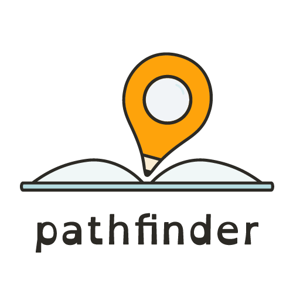

<!-- PROJECT BRIEF -->

# Pathfinder

  
  <h2> Pathfinder Project </h2>
  

    Design and develop an online digital solution to help students with dyslexia. 
  

  <a href="https://github.com/lbeique/Pathfinder/issues">Report Bug</a>
·
<a href="https://github.com/lbeique/Pathfinder/issues">Request Feature</a>

<!-- TABLE OF CONTENTS -->

  
Table of Contents

  <ol>
    <li>
      <a href="#project-overview">Project Overview</a>
      <ul>
        <li><a href="#built-with">Built With</a></li>
        <li><a href="#purpose">Purpose</a></li>
        <li><a href="#main-features">Main Features</a></li>
      </ul>
    </li>
      <li>
        <a href="#links">Links</a>
        <ul>
          <li><a href="#timeline-and-roadmap">Timeline and Roadmap</a></li>
          <li><a href="#design-and-research">Design and Research</a></li>
          <li><a href="#development">Development Servers</a></li>
          <li><a href="#live-server">Live Server</a></li>
        </ul>
      </li>
    <li><a href="#screenshots">Screenshots</a></li>
    <li><a href="#getting-started">Getting Started</a></li>
    <li><a href="#team-members">Team Members</a></li>
    <li><a href="#license">License</a></li>
    <li><a href="#contact">Contact</a></li>
  </ol>

 
 

<!-- ABOUT THE PROJECT -->

# Project Overview

Pathfinder is a study/assignment helper that reformats assignment requirements or other educational resources so they are easier for students with learning/reading disabilities to understand.

#### Built With

- [![Next][next.js]][next-url]
- [![React][react.js]][react-url]
- [![Storybook][storybook.js]][storybook-url]
- [![MySQL][mysql]][mysql-url]

 

<!-- PURPOSE-->

## Purpose

Students with dyslexia or other reading difficulties often experience more hardships when trying to understand their assignment requirements and course materials than the average student. Our goal is to make these resources easier to digest for an enhanced learning experience.

(<a href="#readme-top">back to top</a>)

 

<!-- MAIN FEATURES -->

# Main Features

- Text Summarization
- Dictionary
- Adjust text setting based on user preferences
- Highlight words/paragraphs and save them to the file
- Save reformatted files into the personal library
- Course materials organization

(<a href="#readme-top">back to top</a>)

 

# Links

<!-- JIRA BOARD -->

### Timeline and Roadmap

- Visit our <a href="https://annajeong.atlassian.net/jira/software/projects/PATHFINDER/boards/1/roadmap"><strong>Jira Board</strong></a>

 

<!-- DESIGN DOCUMENTS -->

### Design and Research

- Go to our Initial Design Research on <a href="https://www.figma.com/file/5uhAAMwg8mkt4xLeN6tnzy/Research?node-id=0%3A1"><strong>Figjam</strong></a>

- Go to our Hi-Fi prototype on <a href="https://www.figma.com/file/PNC3AjvkvWIGoYZZnWpmAA/Lofi%2FHifi?node-id=1038%3A2961"><strong>Figma</strong></a>

 

<!-- DEVELOPMENT -->

### Development

- Backend API Server:
  <a href="https://github.com/CalliStef/PathFinder-Hermes"><strong>Hermes</strong></a>

- Next.js Server:
  <a href="https://github.com/hlee443/PathFinder-Athena"><strong>Athena</strong></a>

 

<!-- LIVE SERVER -->

### Live Server

- Visit <a href="https://www.path-finder.ca/"><strong>Pathfinder</strong></a>

(<a href="#readme-top">back to top</a>)

 

# Screenshots

 

<!-- GETTING STARTED -->

# Getting Started

All you need to do is visit <a href="https://www.path-finder.ca/"><strong>our website</strong></a> and you can instantly start using our project.

 
 

<!-- TEAM MEMBERS -->

# Team Members

- [Laurent Beique](https://github.com/lbeique)
- [Cheryl Ho](https://github.com/cho196)
- [Anna Jeong](https://github.com/seohyun9672)
- [Daesan Kim](https://github.com/CalliStef)
- [Ivy Lee](https://github.com/hlee443)
- [Callista Stefanie Taswin](https://github.com/CalliStef)

 
 

<!-- LICENSE -->

# License

Distributed under the MIT License. See `LICENSE.txt` for more information.

 
 

<!-- CONTACT -->

# Contact

If you are looking to help or contribute with the project, please contact:

Laurent Beique - [@BeiqueLaurent](https://twitter.com/BeiqueLaurent) - lbeique@outlook.com

(<a href="#readme-top">back to top</a>)

<!-- MARKDOWN LINKS & IMAGES -->

[next.js]: https://img.shields.io/badge/next.js-20232A?style=for-the-badge&logo=nextdotjs&logoColor=white
[next-url]: https://nextjs.org/
[react.js]: https://img.shields.io/badge/React-20232A?style=for-the-badge&logo=react&logoColor=61DAFB
[react-url]: https://reactjs.org/
[storybook.js]: https://img.shields.io/badge/Storybook-20232A?style=for-the-badge&logo=storybook&logoColor=FF4785
[storybook-url]: https://storybook.js.org/
[mysql]: https://img.shields.io/badge/MySQL-20232A?style=for-the-badge&logo=mysql&logoColor=035480
[mysql-url]: https://www.mysql.com/
