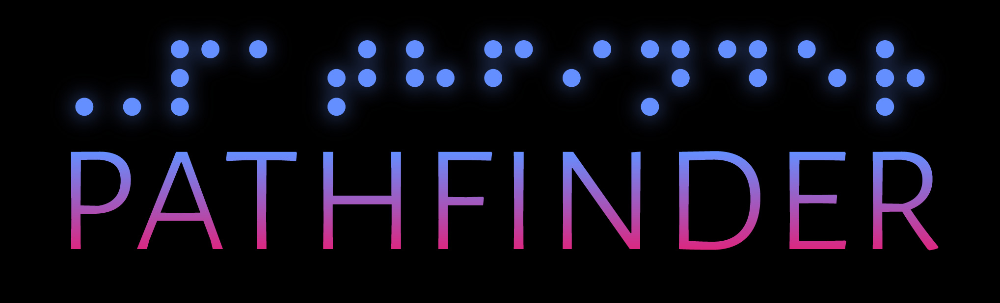

<a name="readme-top"></a>


<!-- PROJECT LOGO -->
<br />
<div align="center">
  <a href="https://github.com/lbeique/Pathfinder">
    
  </a>

<h3 align="center">Pathfinder</h3>

  <p align="center">
    The Pathfinder Application.
    <br />
    <a href="https://github.com/lbeique/Pathfinder"><strong>Explore the docs »</strong></a>
    <br />
    <br />
    <a href="https://github.com/lbeique/Pathfinder">View Demo</a>
    ·
    <a href="https://github.com/lbeique/Pathfinder/issues">Report Bug</a>
    ·
    <a href="https://github.com/lbeique/Pathfinder/issues">Request Feature</a>
  </p>
</div>


<!-- TABLE OF CONTENTS -->
<details>
  <summary>Table of Contents</summary>
  <ol>
    <li>
      <a href="#about-the-project">About The Project</a>
      <ul>
        <li><a href="#built-with">Built With</a></li>
      </ul>
    </li>
    <li>
      <a href="#getting-started">Getting Started</a>
      <ul>
        <li><a href="#prerequisites">Prerequisites</a></li>
        <li><a href="#installation">Installation</a></li>
      </ul>
    </li>
    <li><a href="#usage">Usage</a></li>
    <li><a href="#design-prototypes">Design Prototypes</a></li>
    <li><a href="#roadmap">Roadmap</a></li>
    <li><a href="#license">License</a></li>
    <li><a href="#contact">Contact</a></li>
    <li><a href="#Collaborators">Collaborators</a></li>
  </ol>
</details>


<!-- ABOUT THE PROJECT -->
## About The Project

Pathfinder is an application that allows users to navigate the web in an accessibility friendly way.


<p align="right">(<a href="#readme-top">back to top</a>)</p>


### Built With

* [![Next][Next.js]][Next-url]
* [![React][React.js]][React-url]
* [![Storybook][Storybook.js]][Storybook-url]
* [![MySQL][MySQL]][MySQL-url]

<p align="right">(<a href="#readme-top">back to top</a>)</p>


<!-- GETTING STARTED -->
## Getting Started

Prerequisites, documentation, and guides can be included in this section.

### Prerequisites

This is where we can list the project dependencies.

* npm
  ```sh
  npm install npm@latest -g
  ```

### Installation

This is where we can detail the installation process.

1. Get a free API Key at [https://example.com](https://example.com)
2. Clone the repo
   ```sh
   git clone https://github.com/github_username/repo_name.git
   ```
3. Install NPM packages
   ```sh
   npm install
   ```
4. Enter your API in `config.js`
   ```js
   const API_KEY = 'ENTER YOUR API';
   ```

<p align="right">(<a href="#readme-top">back to top</a>)</p>


<!-- USAGE EXAMPLES -->
## Usage

We can use this space to showcase how to use the application.

_For more examples, please refer to the [Documentation](https://example.com)_

<p align="right">(<a href="#readme-top">back to top</a>)</p>


<!-- DESIGN DOCUMENTS -->
## Design Prototypes

Pathfinder's early research Figjam:
<a href="https://www.figma.com/file/5uhAAMwg8mkt4xLeN6tnzy/Research"><strong>Pathfinder Figjam</strong></a>

Pathfinder's early design Figma:
<a href="https://www.figma.com/file/9d94dbWawYK0n9Iy2kdOn9/Design?node-id=0%3A1"><strong>Pathfinder Figma</strong></a>

<p align="right">(<a href="#readme-top">back to top</a>)</p>


<!-- ROADMAP -->
## Roadmap

- [ ] Feature 1
- [ ] Feature 2
- [ ] Feature 3
    - [ ] Nested Feature

See the [open issues](https://github.com/github_username/repo_name/issues) for a full list of proposed features (and known issues).

<p align="right">(<a href="#readme-top">back to top</a>)</p>


<!-- LICENSE -->
## License

Distributed under the MIT License. See `LICENSE.txt` for more information.

<p align="right">(<a href="#readme-top">back to top</a>)</p>


<!-- CONTACT -->
## Contact

Laurent Beique - [@BeiqueLaurent](https://twitter.com/BeiqueLaurent) - lbeique@outlook.com

Project Link: [https://github.com/lbeique/Pathfinder](https://github.com/lbeique/Pathfinder)

<p align="right">(<a href="#readme-top">back to top</a>)</p>


<!-- Collaborators -->
## Collaborators

* [Cheryl Ho](https://twitter.com/BeiqueLaurent)
* [Ivy Lee](https://twitter.com/BeiqueLaurent)
* [Callista Stefanie Taswin](https://twitter.com/BeiqueLaurent)
* [Anna Jeong](https://twitter.com/BeiqueLaurent)
* [Daesan Kim](https://twitter.com/BeiqueLaurent)

<p align="right">(<a href="#readme-top">back to top</a>)</p>


<!-- MARKDOWN LINKS & IMAGES -->
[Next.js]: https://img.shields.io/badge/next.js-20232A?style=for-the-badge&logo=nextdotjs&logoColor=white
[Next-url]: https://nextjs.org/
[React.js]: https://img.shields.io/badge/React-20232A?style=for-the-badge&logo=react&logoColor=61DAFB
[React-url]: https://reactjs.org/
[Storybook.js]: https://img.shields.io/badge/Storybook-20232A?style=for-the-badge&logo=storybook&logoColor=FF4785
[Storybook-url]: https://storybook.js.org/
[MySQL]: https://img.shields.io/badge/MySQL-20232A?style=for-the-badge&logo=mysql&logoColor=035480
[MySQL-url]: https://www.mysql.com/
